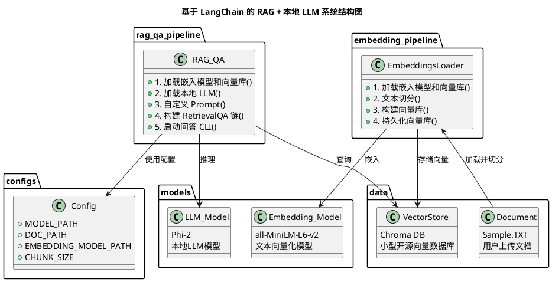
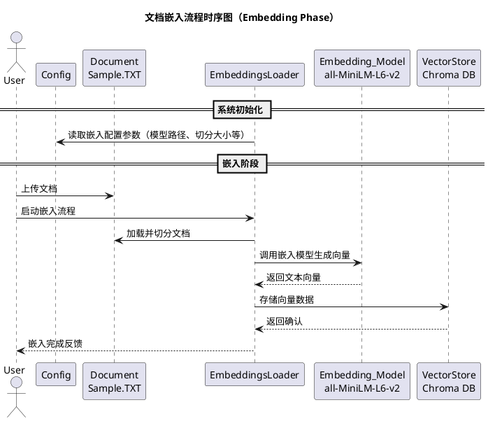
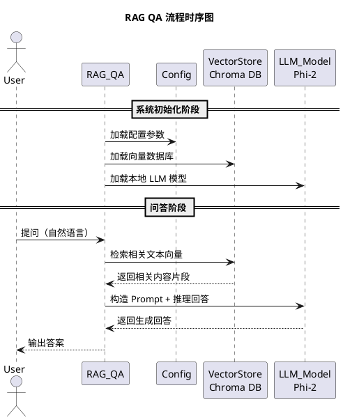

## 项目结构

```
langchain_rag_minimal/
├── docs/                      ← 放原始文档
│   └── example.txt
├── models/                    ← 模型
│   └── phi-2.Q4_K_M.gguf      ← gguf LLM 模型  
│   └── embedding
│     └── all-MiniLM-L6-v2     ← 文本向量化模型
├── db/                        ← 存储向量库
├── config.py                  ← 参数配置
├── embeddings_loader.py       ← 文档处理模块
├── rag_qa.py                  ← 问答模块
├── semantic_search            ← 问答模块(不使用LLM，单纯向量库匹配)
├── requirements.txt
```

## 环境准备

```
Python 3.10.11

# 在项目根目录执行
python -m venv .venv
.venv\Scripts\activate  # Windows 启动虚拟环境
python -m pip install --upgrade pip
python -m pip install -r requirements.txt

# 下载模型
下载phi-2.Q4_K_M.guff（尺寸小）后存放到models目录下
https://huggingface.co/TheBloke/phi-2-GGUF/tree/main

# /models/embedding下使用git clone
https://huggingface.co/sentence-transformers/all-MiniLM-L6-v2/tree/main

```

## 测试执行
```
#建立向量库
python embeddings_loader.py

#运行Qa CLI
python rag_qa.py

# 退出
deactivate 
```

## 基础知识介绍

##  About LangChain
> LangChain 是一个用于**构建语言模型应用（LLM Application）**的开源框架，它的核心使命是让 LLM 从“单轮聊天”演进为“具备记忆、工具调用、检索与控制能力的智能体”。
> 它的定位不是“另一个模型”，而是将以下这些模块“链”接起来，形成一个可控、可调用的智能处理流程：

### LangChain 的关键组成模块（模块化设计）


| 模块名称                | 功能描述               | 常见实现                                |
| ------------------- | ------------------ | ----------------------------------- |
| **LLM（语言模型）**       | 本地或远程模型，进行语言生成     | OpenAI、GPT4All、ChatGLM 等    |
| **Prompt 模板**       | 预设的提示词结构，控制 LLM 行为 | `PromptTemplate`                    |
| **Document Loader** | 加载外部知识，如 PDF/TXT   | `PyPDFLoader`, `UnstructuredLoader` |
| **Text Splitter**   | 切割长文档为可处理块         | `RecursiveCharacterTextSplitter`    |
| **Embedding Model** | 向量化文本，构建语义索引       | HuggingFace、OpenAI Embedding        |
| **Vector Store**    | 存储与检索文档向量          | Chroma、FAISS、Weaviate               |
| **Retriever**       | 查询相关文档片段           | `.as_retriever()`                   |
| **Chain**           | 任务逻辑的组合器           | QAChain、ConversationalChain 等       |
| **Agent（可选）**   | 具备工具调用与任务规划能力的 LLM | ReAct、Tool-Agent             |

## About RAG
> RAG，全称 Retrieval-Augmented Generation（检索增强生成），是为了解决一个核心问题而诞生的：
  语言模型记不住所有知识，也无法自行更新知识。
RAG 架构通过“外部检索 + 生成模型”的组合方式，把 LLM 变成一个实时、动态、有知识背景的问答专家。

> RAG 并不是一个库、模型或 API，而是一种设计思想，它把 LLM 的生成能力与外部知识库结合，解决“闭门造车”的 hallucination(幻觉) 问题。

### RAG的组成模块
| 模块                        | 作用                  | 实现方式                            |
| ------------------------- | ------------------- | ------------------------------- |
| **文档加载器（Loader）**         | 加载原始知识，如 PDF/TXT/网页 | LangChain loaders、自己写 parser    |
| **切分器（Splitter）**         | 把长文档切成小片段，便于嵌入      | Chunk + Overlap                 |
| **嵌入模型（Embedding Model）** | 把文字转成向量，便于相似度比较     | all-MiniLM-L6-v2 / BGE / OpenAI |
| **向量数据库（Vector Store）**   | 存储所有片段的向量表示         | Chroma / FAISS / Weaviate       |
| **检索器（Retriever）**        | 从向量库找出与问题最相关的文档     | Top-K + similarity search       |
| **语言模型（LLM）**             | 生成最终的自然语言回答         | 本地模型 or OpenAI GPT              |
| **Prompt 设计**             | 把问题 + 片段组合成输入提示     | 模板定制 + 链式处理                     |

### RAG与LLM差异

| 能力        | 纯 LLM     | RAG          |
| --------- | --------- | ------------ |
| **知识更新**  | 只能靠重新训练   | 随时替换文档       |
| **事实性回答** | 容易幻觉      | 文档支撑更可信      |
| **多语言支持** | 视训练数据而定   | 可用多语种嵌入与文档   |
| **本地化部署** | 需要庞大模型和训练 | RAG 用轻量模型也能做 |

## About LLM
> Large Language Model（大语言模型）,一种基于神经网络、通过大规模语料训练，能够理解、生成自然语言的 AI 模型。本质上是预测下一个词 的概率模型（语言建模）。
常见的模型有GPT 系列（OpenAI）、LLaMA（Meta）、Gemma（Google）、Claude（Anthropic）、PaLM、Mistral 等。

### LLM 的基础架构模块

| 模块                 | 说明                                  |
| ------------------ | ----------------------------------- |
| **Tokenizer（分词器）** | 将文本拆分为 token，模型不能直接处理原始文字           |
| **Embedding 层**    | 将 token 映射为向量，输入模型                  |
| **Transformer 结构** | 使用 Self-Attention，建模词之间关系，是 LLM 的核心 |
| **Decoder（解码器）**   | 按照概率逐词生成输出内容                        |
| **位置编码**           | 提供 token 之间的位置信息，保持语序语义             |

### LLM 的主要能力

| 能力   | 示例          |
| ---- | ----------- |
| 语言理解 | 问答、摘要、翻译、改写 |
| 内容生成 | 写作、诗歌、剧本、代码 |
| 推理   | 归纳、演绎、多步逻辑  |
| 对话记忆 | 上下文管理、多轮对话  |
| 模拟角色 | 模仿风格、设定人格   |

### 技术特点

| 特点       | 说明                                                          |
| -------- | ----------------------------------------------------------- |
| 海量训练数据   | 常见使用互联网文本（如 Wikipedia, Github, StackOverflow, Common Crawl） |
| 高参数量     | 从 1B（十亿）到 180B（千亿）不等                                        |
| 多任务泛化    | 一个模型能应对多种任务（零样本/少样本）                                        |
| 预训练 + 微调 | 先“通才训练”，后“专才微调”或 RAG 增强                                     |
| 多语言支持    | 高质量模型能处理多种自然语言（英语最优，中文、日文次之）                                |

### LLM 并不是 “懂” 语言

| 不等式               | 说明                 |
| ----------------- | ------------------ |
| LLM ≠ 理解          | 它并不“理解”语言，而是“预测”语言 |
| LLM ≠ 搜索          | 它没有内置知识库，不能实时查资料   |
| LLM ≈ 模型记忆 + 概率生成 | 是从统计学角度“看起来很聪明”的东西 |

### LLM 的上下游生态

| 层级  | 技术/代表系统                                           |
| --- | ------------------------------------------------- |
| 应用层 | 智能客服、教育机器人、AI编程助手、写作助手                            |
| 框架层 | **LangChain**, LlamaIndex, Transformers, Haystack |
| 模型层 | GPT-4, Claude, LLaMA, Mistral, PaLM               |
| 部署层 | HuggingFace, OpenAI API, Ollama, llama-cpp-python |
| 硬件层 | GPU/TPU 加速、推理优化、量化                                |








## 拓展思维

- 输入增强
  - Office文档 - 
  - PDF文档 - OCR模型识别后向量化
- 输出增强: 基于Web界面
- 系统扩展： 用户验证